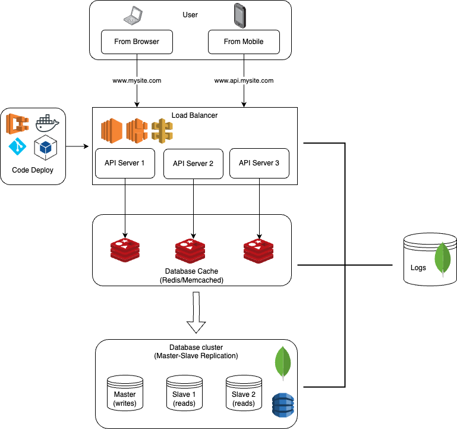

# Scaling Strategy Document

## 1. Introduction

This document outlines the scaling strategy for the JungleOlympics.API, designed to accommodate millions of users.

JungleOlympics.Api is a minimal API service that provides information about animal teams based on the number of their legs.

We have six public facing CRUD endpoints, with one DB model, the Animal class. We calculate the teams programatically, on the fly.

Endpoints:

- GET - api/animal – Returns list of all signed up animals.
- GET – api/animal/{id} – returns details about the animal (number of legs, name…)
- GET – api/animalTeams/ – returns the number of the teams (only the completed ones)
- PUT – api/animal/{id} – updates the animal (name, number of legs, sound of the animal…)
- POST – api/animal – creates new animal (name, number of legs, sound of the animal…)
- DELETE – api/animal/{id} – deletes the selected animal.

This document covers the strategies for scaling the JungleOlympics using load balancers, API servers, database, and caching layer to ensure high availability, performance, and a seamless user experience.

Starting of, here is a high level diagram of the strategies discussed in this document:

## 2. Objectives

- Maintain optimal performance and quick response times for all API operations.
- Ensure high availability of the API and its data.
- Minimize downtime and service interruptions during scaling operations.

## 3. Components to Scale

### 3.1 API Servers

- **Initial Setup**: We start with a cluster of API servers sufficient to handle the average load with redundancy.
- **Horizontal Scaling (Out/In)**: We automatically add or remove servers based on CPU or RAM utilization thresholds. Use cloud services like AWS Auto Scaling Groups or Kubernetes Horizontal Pod Autoscaler.
- **Vertical Scaling (Up/Down)**: Periodically review server performance. Upgrade server specs if the average load consistently pushes the current servers near their capacity.

### 3.2 Database

- **Initial Setup**: Use a distributed NoSQL database like MongoDB with replication or DynamoDB to ensure data availability and fault tolerance.
- **Horizontal Scaling (Sharding)**: Implement database sharding to distribute data across multiple databases to reduce the load on any single database instance.
- **Read Replicas**: Increase the number of read replicas to scale read operations, especially for frequently accessed data.
- **Connection Pooling**: Implement connection pooling to reuse database connections, reducing the overhead of creating new connections.

### 3.3 Caching Layer

- **Initial Setup**: Deploy a distributed caching system like Redis Cluster.
- **Horizontal Scaling**: Add more nodes to the caching system to increase its capacity to handle more data and concurrent connections.
- **Cache Invalidation Strategy**: Implement a robust cache invalidation strategy to ensure data consistency.

### 3.4 Load Balancers

- **Initial Setup**: Deploy load balancers to distribute incoming traffic evenly across API servers.
- **Scaling**: Use cloud-based load balancers (e.g., AWS Elastic Load Balancer) that automatically scale with incoming traffic.

## 4. Monitoring and Metrics

- **Performance Metrics**: Monitor CPU, RAM, disk I/O, and network throughput on all servers.
- **Database Metrics**: Monitor query execution times, number of connections, and replication lag for databases.
- **Error Rates**: Monitor the API error rates and response times.
- **Traffic Patterns**: Analyze traffic patterns to predict scaling needs ahead of time.

## 5. Auto-scaling Policies

- Auto-scaling policies based on key metrics such as CPU utilization (>80% for scaling up, <50% for scaling down), memory usage, and request queue length.
- Cool-down periods to prevent thrashing (frequent scale-in and scale-out).

## 6. Scalability Testing

- Regular load testing to identify bottlenecks and validate the effectiveness of the scaling strategy.
